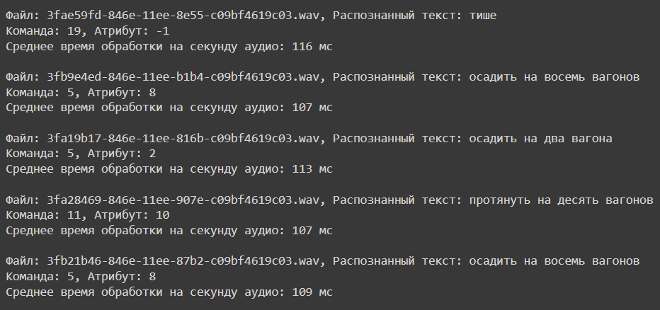

# 
<h1 align="center">Установка</h1>

  <li>Клонируйте этот репозиторий</li>

  <li>Установите <a href = 'https://www.anaconda.com/download'>Anaconda</a> </li>

  <li>Распакуйте папку репозитория</li>
  
  <li>Запустите Anaconda Promt (miniconda3) от имени администратора</li>
  
  <li>Перейдите в терминале в распакованную папку</li> 
  
  
      cd "C:\Ваш_путь"
  
  <li>активация среды (поочередно вводите команды)</li> 
  
      conda env create -f environment.yml

      conda activate niiasenv

      jupyter notebook

  У вас запустится браузер. 
  В случае, если будет ошибка и страница не выведется - скопируйте из терминала одну из двух ссылок и перейдите по ней. Ниже приведен пример ссылки.

  
  

     http://localhost:8888/tree?token=06498a3d860718b6fcdb4c0f2499c7f30951923b6887c287
  
<li>Откройте и запустите файл "main.ipynb"</li> 

<h2>Как это работает</h2>

